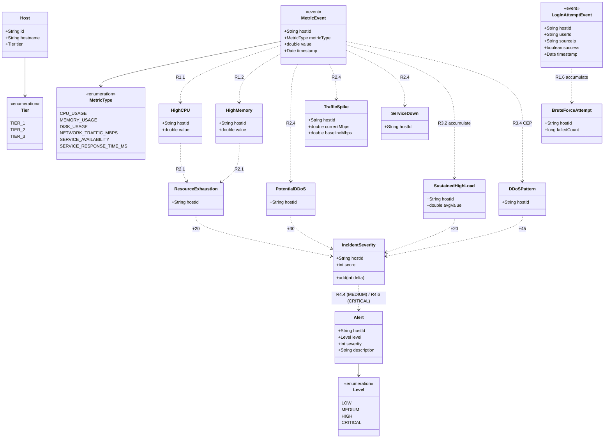

# SBNZ — Sistem za upravljanje IT infrastrukturom i detekciju incidenata

Pravila-bazirani sistem (Drools) koji klasifikuje sirove metrike i događaje
kroz **4 nivoa forward chaining-a** — od pojedinačnih anomalija (Nivo 1) do
finalnog Alert-a (Nivo 4) — sa CEP i accumulate tehnikama za vremenske
obrasce. Pune specifikacije su u [`spec_latest.md`](spec_latest.md).

## Struktura

```
incident-detection-app/
├── model/      POJO činjenice i događaji (com.ftn.sbnz.model)
├── rules/      DRL pravila + kmodule.xml (Drools knowledge module)
└── service/    Spring Boot servis + JUnit testovi
scripts/        build.sh / test.sh / run.sh
```

## Pokretanje

```bash
./scripts/build.sh   # mvn clean install (skipTests)
./scripts/test.sh    # 18 JUnit testova
./scripts/run.sh     # Spring Boot servis
```

Skripte automatski detektuju Java 21/17/11 preko `/usr/libexec/java_home`.

## Klasni dijagram modela



**Legenda:**
- `<<event>>` — Drools događaj (`@Role(EVENT)`), učestvuje u CEP/accumulate sa `@Timestamp`
- Pune strelice (`-->`) — kompozicija (referenca na enumeraciju)
- Isprekidane strelice (`..>`) — derivacija kroz pravilo (forward chaining); oznaka je broj pravila iz [`spec_latest.md`](spec_latest.md)
- Sve činjenice referenciraju `Host` preko polja `String hostId`

## Pravila po članu tima

| Vlasnik | Paket | Pravila |
|---|---|---|
| Roman Minakov (SV83/2023) — Security | `rules.security` | R1.6, R2.4, R3.4 (CEP), R4.6 |
| Avanesov Roman (SV88/2024) — Infrastructure | `rules.infrastructure` | R1.1, R1.2, R2.1, R3.2 (accumulate), R4.4 |

Svaki vlasnik ima 4–5 pravila koja pokrivaju sva 4 nivoa + jednu naprednu
tehniku iz svoje varijante.
